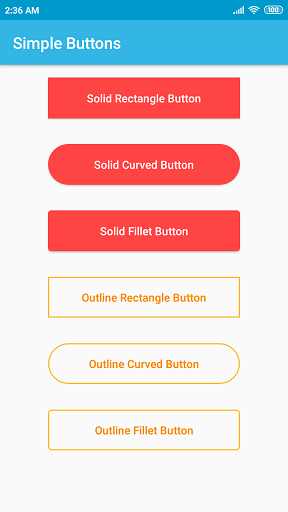

# custom-buttons

### Description :
An Android Simple Button library to add commonly used buttons.

### Minimum API :
API 24

### Integration :

The lib is available on https://jitpack.io.

<b> build.gradle</b> in project module
```
allprojects {
    repositories {
        jcenter()
        maven { url "https://jitpack.io" }
    }
}
```

<b> build.gradle</b> in app module
```
dependencies {
    compile 'com.github.Abhimanyu14:custom-buttons:0.1-alpha.1'
}
```

### Implementation :

<b> XML : </b>

```
<com.appz.abhi.simplebutton.SimpleButton
    android:layout_width="240dp"
    android:layout_height="wrap_content"
    android:layout_gravity="center_horizontal"
    android:layout_margin="16dp"
    android:padding="16dp"
    android:text="Solid Rectangle Button"
    app:button_background_color="@android:color/holo_red_light"
    app:button_pressed_color="@android:color/holo_red_dark"
    app:button_shape="rectangle"
    app:button_text_color="@color/white"
    app:button_type="solid"/>
```

<b> Button Types </b>

1. Solid
2. Outline

<b> Button Shapes </b>

1. Rectangle
2. Curved (Corner radius is half of height )
3. Fillet (Corner radius 8dp )
            
### Screenshots :



### License :

```
Copyright 2019 Abhimanyu

Licensed under the Apache License, Version 2.0 (the "License");
you may not use this file except in compliance with the License.
You may obtain a copy of the License at

    http://www.apache.org/licenses/LICENSE-2.0

Unless required by applicable law or agreed to in writing, software
distributed under the License is distributed on an "AS IS" BASIS,
WITHOUT WARRANTIES OR CONDITIONS OF ANY KIND, either express or implied.
See the License for the specific language governing permissions and
limitations under the License.
```
